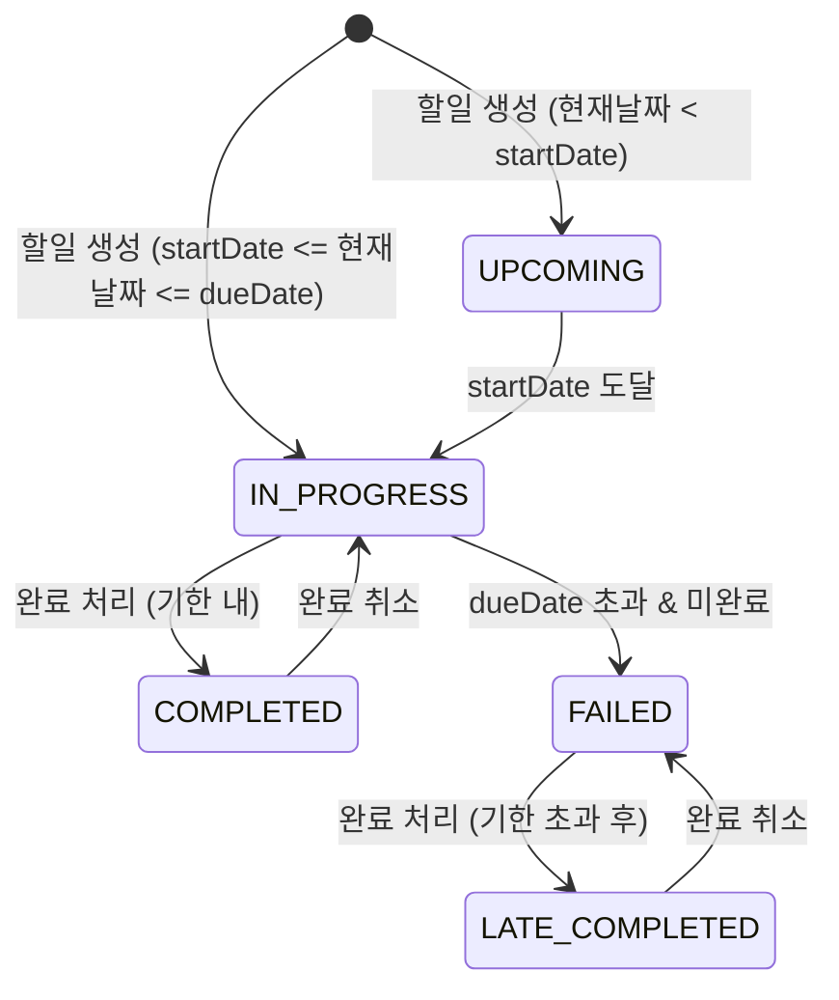

# 도메인 정의서

**프로젝트명:** todolist-app  
**작성일:** 2026-03-31  
**버전:** 0.2.0  
**작성자:** Dan Jung  

### 변경 이력

| 버전 | 날짜 | 변경 내용 | 작성자 |
|---|---|---|---|
| 0.1.0 | 2026-03-31 | 초안 작성 | Dan Jung |
| 0.2.0 | 2026-03-31 | 상태 모델 정합성 수정, 수용 기준 추가, 비기능 요구사항 추가, 추적성 강화 | Dan Jung |
| 0.3.0 | 2026-04-01 | 비밀번호 복잡도 규칙 추가(BR-11), JWT 인증 방식 명확화 | Dan Jung |

---

## 1. 프로젝트 개요

개인별 할일 관리 웹 애플리케이션으로, 사용자 인증 기반의 독립적인 할일 관리 환경을 제공한다.
기존 일정 관리 앱의 한계인 개인 맞춤 관리 부재 및 할일 시작일/종료일 관리 기능 부족을 해결하는 것이 핵심 목표다.

---

## 2. 핵심 도메인 개념

### 2.1 엔티티

#### User (사용자)

| 속성 | 타입 | 필수 | 설명 |
|---|---|---|---|
| id | UUID | Y | 사용자 고유 식별자 |
| email | String | Y | 로그인 이메일 (고유값) |
| password | String | Y | 암호화된 비밀번호 (bcrypt) |
| name | String | Y | 사용자 이름 |
| createdAt | DateTime | Y | 가입일시 |

#### Todo (할일)

| 속성 | 타입 | 필수 | 설명 |
|---|---|---|---|
| id | UUID | Y | 할일 고유 식별자 |
| userId | UUID | Y | 소유 사용자 참조 (User.id) |
| title | String | Y | 할일 제목 (최대 200자) |
| description | String | N | 할일 상세 내용 (최대 2000자) |
| startDate | Date | Y | 할일 시작일 |
| dueDate | Date | Y | 할일 종료일 |
| isCompleted | Boolean | Y | 완료 여부 |
| completedAt | DateTime | N | 완료 처리 일시 (isCompleted=true일 때 서버 시각 자동 기록) |
| createdAt | DateTime | Y | 생성일시 |
| updatedAt | DateTime | Y | 수정일시 |

### 2.2 할일 상태 (TodoStatus)

할일의 도메인 상태는 `isCompleted`, `completedAt`, `startDate`, `dueDate`, 현재 날짜를 기반으로 아래 우선순위에 따라 결정되는 파생 상태다. 각 조건은 상호 배타적으로 처리된다.

#### 상태 결정 알고리즘 (우선순위 순)

> 상위 조건이 충족되면 이후 조건은 평가하지 않는다.

| 우선순위 | 조건 | 결정 상태 |
|---|---|---|
| 1 | `isCompleted = true` AND `completedAt <= dueDate` | **COMPLETED** |
| 2 | `isCompleted = true` AND `completedAt > dueDate` | **LATE_COMPLETED** |
| 3 | `현재 날짜 < startDate` | **UPCOMING** |
| 4 | `startDate <= 현재 날짜 <= dueDate` AND `isCompleted = false` | **IN_PROGRESS** |
| 5 | `현재 날짜 > dueDate` AND `isCompleted = false` | **FAILED** |

> **CLOSED**는 도메인 상태가 아닌 UI 필터 전용 개념이다. "현재 날짜 > dueDate인 모든 항목(FAILED + LATE_COMPLETED + 기한 초과 COMPLETED)"을 한 번에 필터링할 때 사용하며, 데이터베이스에 저장하거나 API 응답으로 반환하지 않는다.

#### 상태 설명

| 상태 | 설명 |
|---|---|
| UPCOMING | 아직 시작일 전인 할일 |
| IN_PROGRESS | 진행 기간 내 미완료 할일 |
| COMPLETED | 기한 내 완료된 할일 |
| LATE_COMPLETED | 기한 초과 후 완료된 할일 |
| FAILED | 기한 초과 & 미완료 할일 |

#### 상태 전이 다이어그램

---

## 3. 비즈니스 규칙

### 접근 제어

- **BR-01:** 모든 할일 관리 기능은 로그인된 사용자만 사용할 수 있다. 미인증 요청 시 401 Unauthorized를 반환한다.
- **BR-02:** 사용자는 본인의 할일만 조회, 생성, 수정, 삭제할 수 있다. 타인의 할일 접근 시 403 Forbidden을 반환한다.

### 할일 데이터 규칙

- **BR-03:** 할일 생성 시 `startDate`와 `dueDate`는 필수 입력값이다. 누락 시 400 Bad Request를 반환한다.
  - 양성 시나리오: `startDate=2026-04-01`, `dueDate=2026-04-30` 입력 시 정상 생성
  - 음성 시나리오: `startDate` 누락 시 400 Bad Request 반환
- **BR-04:** `dueDate`는 `startDate`보다 같거나 이후 날짜여야 한다. 위반 시 400 Bad Request를 반환한다.
  - 양성 시나리오: `startDate=2026-04-01`, `dueDate=2026-04-01` (동일 날짜) 허용
  - 음성 시나리오: `startDate=2026-04-10`, `dueDate=2026-04-01` 입력 시 400 Bad Request 반환
- **BR-05:** `isCompleted`가 `true`로 변경되면 `completedAt`이 서버 현재 시각으로 자동 기록된다. 클라이언트가 `completedAt`을 직접 지정할 수 없다.
  - 양성 시나리오: `isCompleted=true` 요청 시 `completedAt`이 서버 시각으로 자동 설정됨
  - 음성 시나리오: 클라이언트가 `completedAt` 값을 요청 본문에 포함해도 서버 시각으로 덮어씀
- **BR-06:** 완료 처리된 할일의 완료를 취소(`isCompleted=false`)하면 `completedAt`은 null로 초기화된다.
- **BR-07:** 할일 목록은 `dueDate`, `startDate`, `createdAt` 기준으로 오름차순/내림차순 정렬할 수 있다. 정렬 기준 미지정 시 기본값은 `createdAt` 내림차순이다.
- **BR-08:** 할일 목록 조회는 페이지네이션을 지원한다. 기본 페이지 크기는 20개이며 최대 100개까지 허용한다. 페이지 번호는 1부터 시작한다.

### 인증 규칙

- **BR-09:** 인증은 JWT Bearer Token 방식을 사용하며, Access Token 유효기간은 1시간이다. 서명 알고리즘은 HS256, Payload에는 `userId`, `email`, `iat`, `exp`를 포함한다. 만료된 토큰 사용 시 401 Unauthorized를 반환한다.
- **BR-10:** 중복 이메일로 회원가입 시 409 Conflict를 반환한다.
- **BR-11:** 비밀번호는 다음 복잡도 규칙을 모두 충족해야 한다. 미충족 시 400 Bad Request를 반환한다.
  - 최소 8자, 최대 20자
  - 영문 대문자(A-Z) 1자 이상 포함
  - 영문 소문자(a-z) 1자 이상 포함
  - 숫자(0-9) 1자 이상 포함
  - 특수문자(`!@#$%^&*`) 1자 이상 포함

---

## 4. 유스케이스 요약

| ID | 유스케이스 | 액터 | 설명 | 적용 BR |
|---|---|---|---|---|
| UC-01 | 회원가입 | 비인증 사용자 | 이메일, 비밀번호, 이름으로 계정 생성 | BR-10, BR-11 |
| UC-02 | 로그인 | 비인증 사용자 | 이메일/비밀번호 인증 후 JWT 발급 | BR-09 |
| UC-03 | 로그아웃 | 인증된 사용자 | 클라이언트 토큰 폐기 | BR-09 |
| UC-04 | 할일 생성 | 인증된 사용자 | 제목, 시작일, 종료일을 포함한 할일 등록 | BR-01, BR-02, BR-03, BR-04 |
| UC-05 | 할일 목록 조회 | 인증된 사용자 | 상태 필터 및 정렬 기준 적용하여 목록 조회 | BR-01, BR-02, BR-07, BR-08 |
| UC-06 | 할일 상세 조회 | 인증된 사용자 | 특정 할일의 상세 정보 조회 | BR-01, BR-02 |
| UC-07 | 할일 수정 | 인증된 사용자 | 제목, 내용, 시작일, 종료일 수정 | BR-01, BR-02, BR-04 |
| UC-08 | 할일 완료 처리 | 인증된 사용자 | 할일의 완료 여부 업데이트 | BR-01, BR-02, BR-05, BR-06 |
| UC-09 | 할일 삭제 | 인증된 사용자 | 특정 할일 영구 삭제 | BR-01, BR-02 |

### 수용 기준 (Acceptance Criteria)

#### UC-01: 회원가입

- AC-01-1: Given 미가입 이메일로 유효한 형식의 요청 시, When 회원가입 요청, Then 201 Created 및 사용자 ID 반환
- AC-01-2: Given 이미 가입된 이메일로 요청 시, When 회원가입 요청, Then 409 Conflict 반환
- AC-01-3: Given 이메일 형식이 올바르지 않은 요청 시, When 회원가입 요청, Then 400 Bad Request 반환

#### UC-02: 로그인

- AC-02-1: Given 올바른 이메일/비밀번호 입력 시, When 로그인 요청, Then 200 OK 및 JWT Access Token 반환
- AC-02-2: Given 잘못된 비밀번호 입력 시, When 로그인 요청, Then 401 Unauthorized 반환
- AC-02-3: Given 존재하지 않는 이메일로 요청 시, When 로그인 요청, Then 401 Unauthorized 반환

#### UC-04: 할일 생성

- AC-04-1: Given 인증된 사용자가 유효한 startDate, dueDate 포함 요청 시, When 할일 생성, Then 201 Created 및 할일 ID 반환
- AC-04-2: Given dueDate < startDate인 요청 시, When 할일 생성, Then 400 Bad Request 반환
- AC-04-3: Given startDate 누락 요청 시, When 할일 생성, Then 400 Bad Request 반환

#### UC-05: 할일 목록 조회

- AC-05-1: Given 인증된 사용자가 상태 필터 없이 요청 시, When 목록 조회, Then 본인의 할일만 반환
- AC-05-2: Given 상태 필터 IN_PROGRESS로 요청 시, When 목록 조회, Then IN_PROGRESS 상태 할일만 반환
- AC-05-3: Given 페이지 크기를 지정하지 않고 요청 시, When 목록 조회, Then 기본값 20개 이하로 반환

#### UC-08: 할일 완료 처리

- AC-08-1: Given 미완료 할일에 완료 요청 시, When 완료 처리, Then isCompleted=true, completedAt=서버 현재 시각으로 업데이트
- AC-08-2: Given 완료된 할일에 완료 취소 요청 시, When 완료 취소, Then isCompleted=false, completedAt=null로 업데이트
- AC-08-3: Given 타인의 할일에 완료 요청 시, When 완료 처리, Then 403 Forbidden 반환

---

## 5. 용어 정의 (Ubiquitous Language)

| 용어 | 설명 |
|---|---|
| 사용자 (User) | 서비스에 회원 가입하고 인증된 개인 |
| 할일 (Todo) | 사용자가 등록한 개별 작업 단위 |
| 시작일 (startDate) | 할일을 시작하는 날짜 |
| 종료일 (dueDate) | 할일을 완료해야 하는 기한 날짜 |
| 완료 (Completed) | 기한 내에 사용자가 명시적으로 완료 처리한 상태 |
| 지연 완료 (Late Completed) | 종료일 초과 후 완료 처리된 상태 |
| 미완료 (Failed) | 종료일이 지났음에도 완료 처리되지 않은 상태 |
| 진행 중 (In Progress) | 시작일 이후이며 종료일 이전인 미완료 상태 |
| 시작 전 (Upcoming) | 아직 시작일에 도달하지 않은 상태 |
| 종료 필터 (Closed Filter) | 종료일이 지난 모든 할일을 보는 UI 필터 (도메인 상태 아님) |
| 상태 필터 (Status Filter) | 할일 목록을 특정 상태 기준으로 좁혀 보는 기능 |
| 정렬 기준 (Sort Criteria) | 할일 목록의 표시 순서를 결정하는 기준 |
| 수용 기준 (Acceptance Criteria) | 유스케이스 완료를 판단하는 테스트 가능한 조건 |
| 페이지네이션 (Pagination) | 목록 조회 결과를 일정 단위로 나누어 반환하는 방식 |

---

## 6. 비기능 요구사항

| ID | 항목 | 요구사항 |
|---|---|---|
| NFR-01 | 성능 | API 응답시간 95th percentile 300ms 이하 |
| NFR-02 | 보안 | 비밀번호는 bcrypt로 암호화 저장 (cost factor 12 이상) |
| NFR-03 | 인증 | JWT Access Token 유효기간 1시간, Bearer Token 방식 사용 |
| NFR-04 | 가용성 | 월간 가동률 99% 이상 |
| NFR-05 | 입력 제한 | title 최대 200자, description 최대 2000자 |
| NFR-06 | 페이지네이션 | 기본 페이지 크기 20개, 최대 100개, 페이지 번호 1부터 시작 |

---

## 7. 범위 외 (Out of Scope)

현재 버전(v0.2.0)에서 의도적으로 제외된 기능:

- 할일 태그/카테고리 분류
- 할일 공유 및 협업
- 알림/리마인더 기능
- 반복 할일 설정
- 첨부파일 업로드

---

## 8. 관련 문서 (Related Documents)

| 문서명 | 경로/위치 | 설명 |
|---|---|---|
| API 명세서 | docs/2-api-specification.md | REST API 엔드포인트 정의 |
| ERD | docs/3-erd.md | 데이터베이스 엔티티 관계 다이어그램 |
| 아키텍처 문서 | docs/4-architecture.md | 시스템 아키텍처 설계 |
