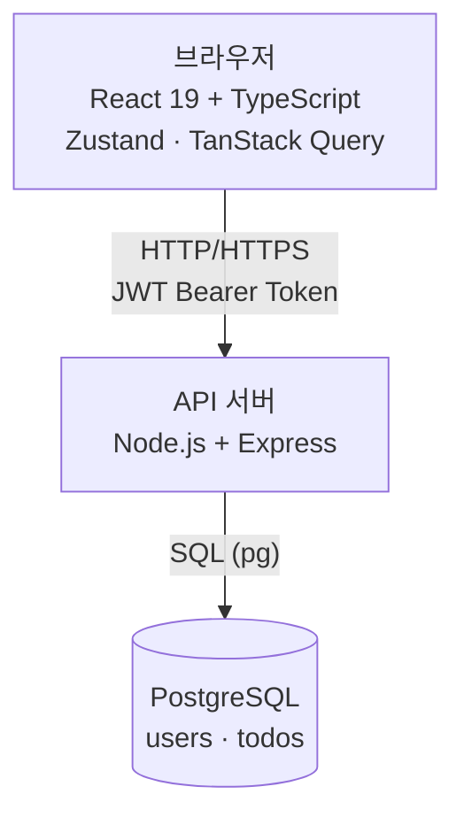
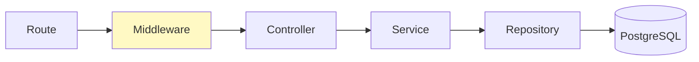
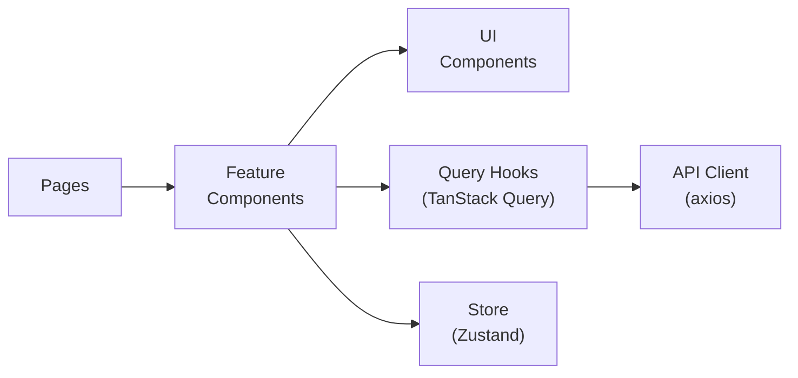
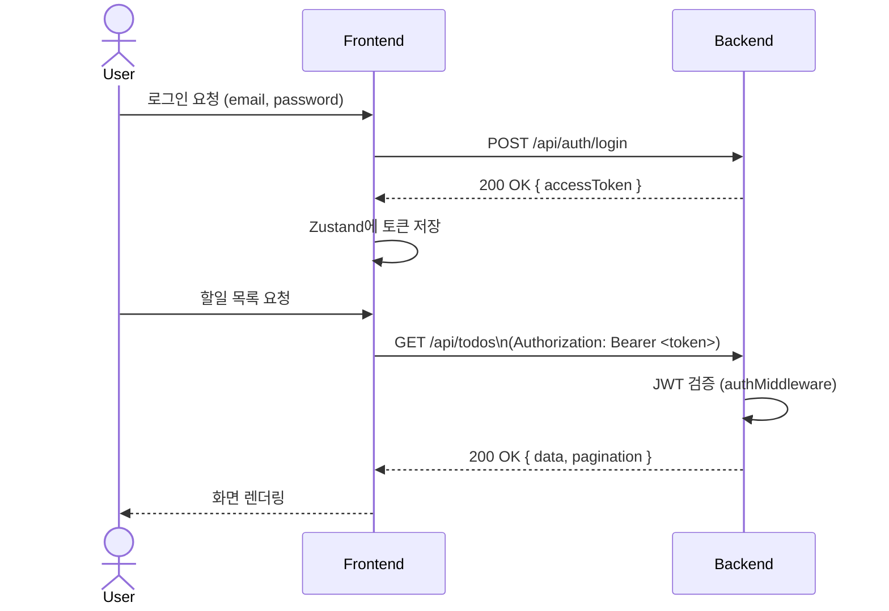
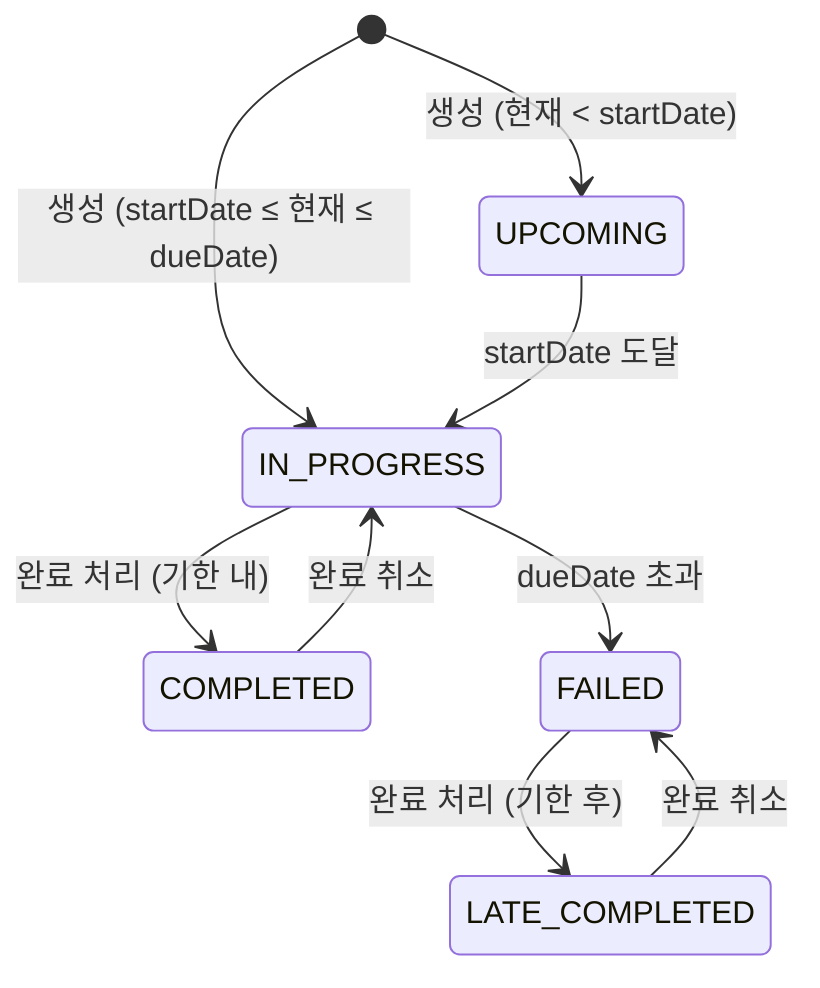
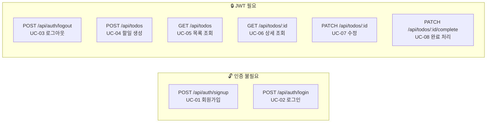

# 기술 아키텍처 다이어그램

**프로젝트명:** todolist-app
**작성일:** 2026-04-01
**버전:** 1.0.0
**작성자:** Dan Jung

---

## 1. 시스템 아키텍처 (3-Tier)

---

## 2. 백엔드 레이어 구조

> 의존 방향은 왼쪽 → 오른쪽 단방향. Repository는 Service를 모르고, Service는 Controller를 모른다.

---

## 3. 프론트엔드 레이어 구조

> - **Pages**: 라우트 단위 최상위 컴포넌트
> - **Feature Components**: Todo 도메인 기능 단위 컴포넌트
> - **UI Components**: props만으로 동작하는 순수 표현 컴포넌트
> - **Query Hooks**: 서버 상태 관리 (할일 목록, 상세 등)
> - **Store**: 클라이언트 상태만 관리 (인증 토큰, UI 상태)
> - **API Client**: axios 인스턴스, JWT 자동 첨부

---

## 4. 인증 흐름 (JWT)

---

## 5. 할일 상태 전이

---

## 6. 데이터 모델 (ERD)

> ERD 상세 내용은 [docs/6-erd.md](./6-erd.md) 참조

---

## 7. API 엔드포인트 구조

