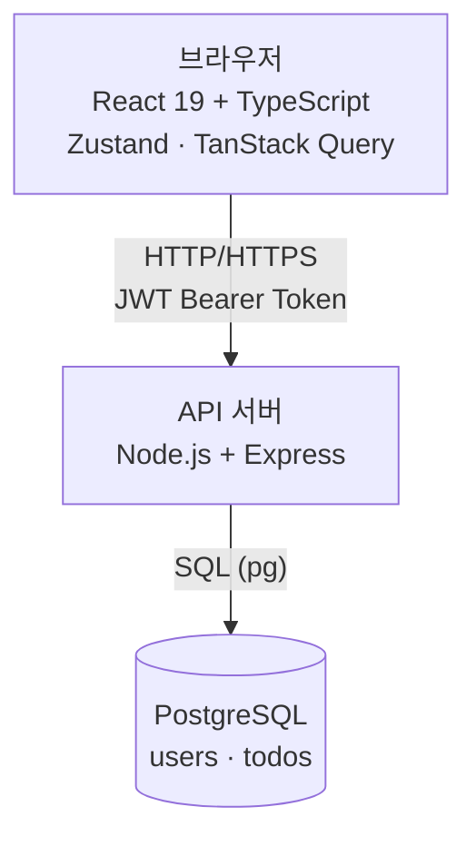
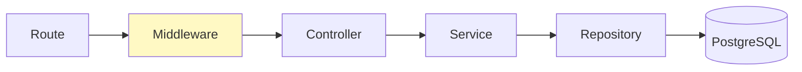
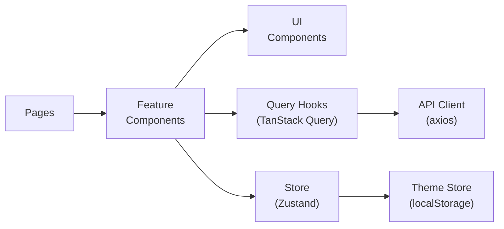
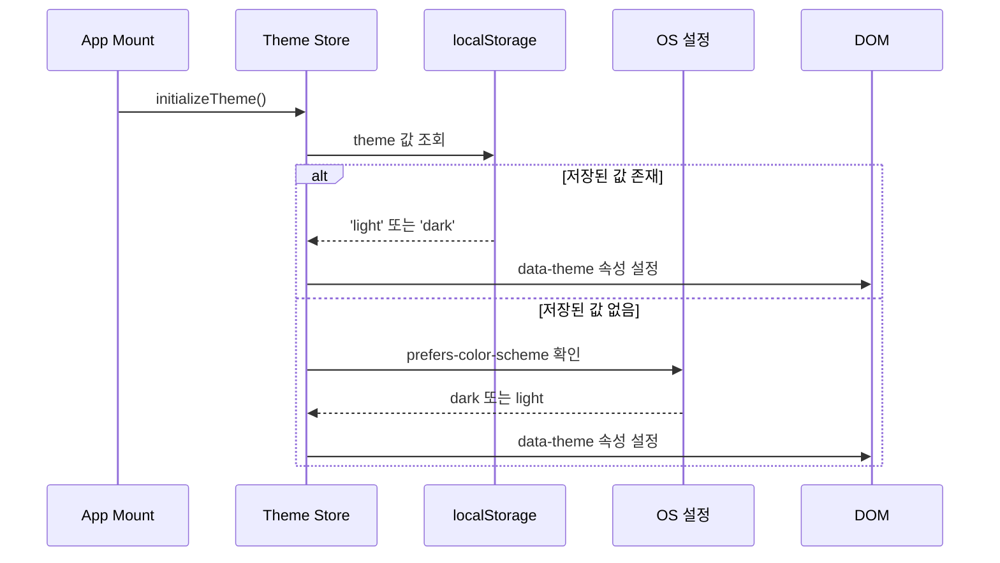
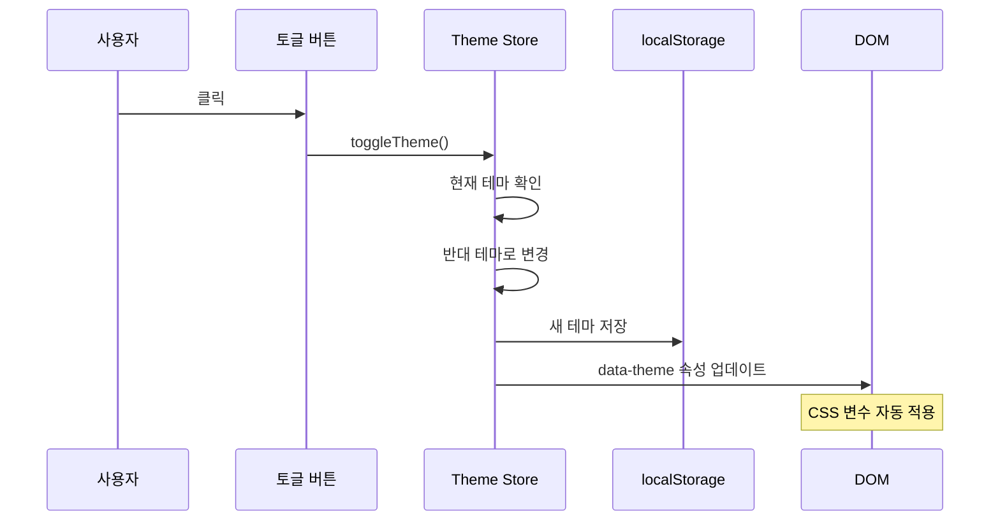
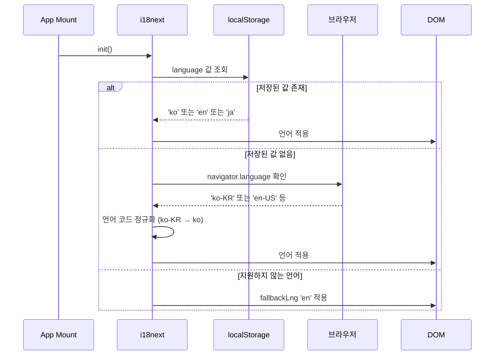
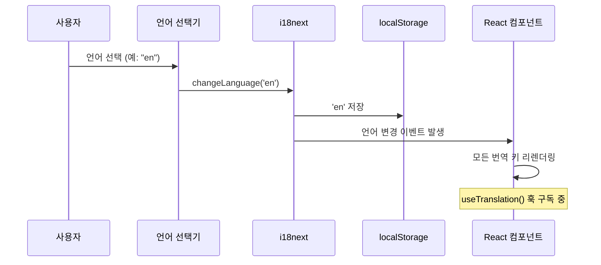
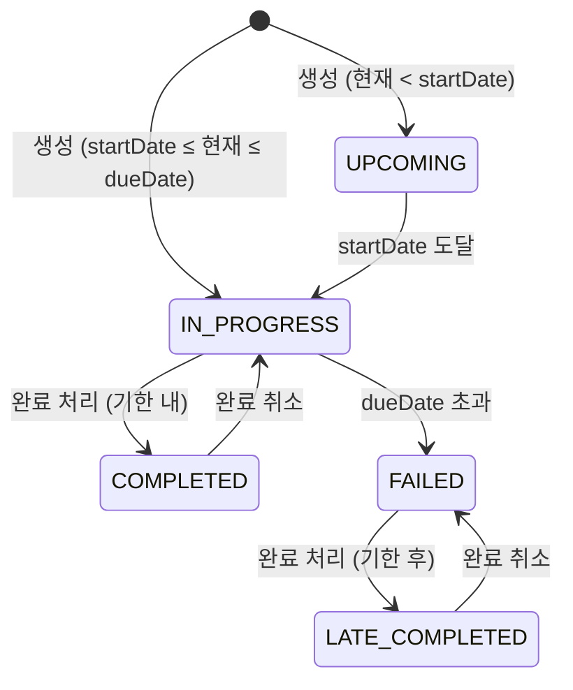
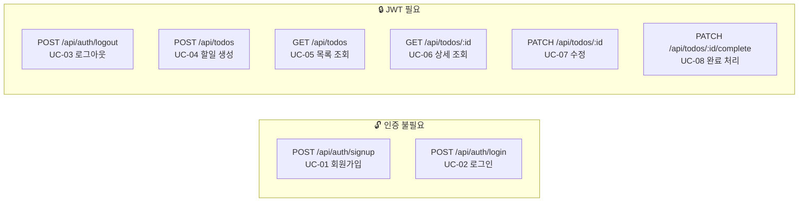

# 기술 아키텍처 다이어그램

**프로젝트명:** todolist-app
**작성일:** 2026-04-01
**버전:** 1.0.0
**작성자:** Dan Jung

---

## 1. 시스템 아키텍처 (3-Tier)



---

## 2. 백엔드 레이어 구조



> 의존 방향은 왼쪽 → 오른쪽 단방향. Repository 는 Service 를 모르고, Service 는 Controller 를 모른다.

---

## 3. 프론트엔드 레이어 구조



> - **Pages**: 라우트 단위 최상위 컴포넌트
> - **Feature Components**: Todo 도메인 기능 단위 컴포넌트
> - **UI Components**: props 만으로 동작하는 순수 표현 컴포넌트
> - **Query Hooks**: 서버 상태 관리 (할일 목록, 상세 등)
> - **Store**: 클라이언트 상태만 관리 (인증 토큰, UI 상태, **테마**)
> - **API Client**: axios 인스턴스, JWT 자동 첨부
> - **Theme Store**: Zustand 기반 테마 관리, localStorage 연동

---

## 3.1 테마 관리 아키텍처

### Zustand Theme Store 구조

```typescript
interface ThemeStore {
  theme: 'light' | 'dark';
  setTheme: (theme: 'light' | 'dark') => void;
  toggleTheme: () => void;
  initializeTheme: () => void;
}

// Store 생성
const useThemeStore = create<ThemeStore>((set, get) => ({
  theme: 'light', // 초기값 (시스템 설정 확인 전)

  setTheme: (theme) => {
    document.documentElement.setAttribute('data-theme', theme);
    localStorage.setItem('theme', theme);
    set({ theme });
  },

  toggleTheme: () => {
    const newTheme = get().theme === 'light' ? 'dark' : 'light';
    get().setTheme(newTheme);
  },

  initializeTheme: () => {
    const saved = localStorage.getItem('theme');
    if (saved) {
      get().setTheme(saved);
    } else {
      const system = window.matchMedia('(prefers-color-scheme: dark)').matches
        ? 'dark'
        : 'light';
      get().setTheme(system);
    }
  }
}));
```

### 테마 초기화 플로우



### 테마 토글 동작



### localStorage 스키마

| 키 | 값 | 설명 |
|---|---|---|
| `theme` | `"light"` \| `"dark"` | 사용자 테마 선호도 |

### 시스템 연동 동작

| 상황 | 동작 |
|---|---|
| **첫 방문** | 시스템 설정 감지하여 적용 |
| **수동 토글 후** | localStorage 에 저장된 값 우선 사용 |
| **시스템 설정 변경** | 수동 토글 이력 있으면 무시, 없으면 반영 |

---

## 3.2 다국어 지원 아키텍처 (i18next)

### i18next 설정 구조

```typescript
// frontend/src/i18n/config.ts
import i18n from 'i18next';
import { initReactI18next } from 'react-i18next';
import LanguageDetector from 'i18next-browser-languagedetector';

import translationKO from '../locales/ko/common.json';
import translationEN from '../locales/en/common.json';
import translationJA from '../locales/ja/common.json';

const resources = {
  ko: { translation: translationKO },
  en: { translation: translationEN },
  ja: { translation: translationJA },
};

i18n
  .use(LanguageDetector)
  .use(initReactI18next)
  .init({
    resources,
    fallbackLng: 'en', // 번역 누락 시 영어로 폴백
    supportedLngs: ['ko', 'en', 'ja'],
    interpolation: {
      escapeValue: false, // React 는 기본적으로 XSS 방지
    },
    detection: {
      order: ['localStorage', 'navigator', 'htmlTag'],
      caches: ['localStorage'],
    },
  });

export default i18n;
```

### 언어 리소스 디렉토리 구조

```
frontend/src/locales/
├── ko/
│   ├── common.json      # 공통 UI (버튼, 메뉴, 메시지)
│   ├── auth.json        # 인증 관련 (로그인, 회원가입)
│   ├── todo.json        # 할일 관련 (상태, 액션)
│   └── validation.json  # 검증 메시지
├── en/
│   ├── common.json
│   ├── auth.json
│   ├── todo.json
│   └── validation.json
└── ja/
    ├── common.json
    ├── auth.json
    ├── todo.json
    └── validation.json
```

### 번역 키 네이밍 컨벤션

```
{섹션}.{요소}.{상태/변수}

예시:
- common.buttons.submit      → "제출" / "Submit" / "送信"
- auth.login.title           → "로그인" / "Login" / "ログイン"
- todo.status.completed      → "완료" / "Completed" / "完了"
- validation.required        → "필수 항목입니다" / "Required" / "必須です"
```

### 언어 선택 컴포넌트 구조

```typescript
// frontend/src/components/common/LanguageSelector.tsx
interface LanguageOption {
  code: string;
  label: string;
  flag?: string;
}

const languages: LanguageOption[] = [
  { code: 'ko', label: '한국어' },
  { code: 'en', label: 'English' },
  { code: 'ja', label: '日本語' },
];

function LanguageSelector() {
  const { i18n } = useTranslation();

  const handleChange = (langCode: string) => {
    i18n.changeLanguage(langCode);
    localStorage.setItem('language', langCode);
  };

  return (
    <select
      value={i18n.language}
      onChange={(e) => handleChange(e.target.value)}
      aria-label="Language selection"
    >
      {languages.map((lang) => (
        <option key={lang.code} value={lang.code}>
          {lang.label}
        </option>
      ))}
    </select>
  );
}
```

### 언어 초기화 플로우



### 언어 변경 동작



### localStorage 스키마

| 키 | 값 | 설명 |
|---|---|---|
| `language` | `"ko"` \| `"en"` \| `"ja"` | 사용자 언어 선호도 |
| `theme` | `"light"` \| `"dark"` | 사용자 테마 선호도 |

### 번역 리소스 예시

```json
// frontend/src/locales/ko/common.json
{
  "buttons": {
    "submit": "제출",
    "cancel": "취소",
    "save": "저장",
    "delete": "삭제",
    "edit": "수정",
    "view": "보기",
    "close": "닫기"
  },
  "menu": {
    "logout": "로그아웃",
    "profile": "프로필",
    "settings": "설정"
  },
  "messages": {
    "loading": "로딩 중...",
    "error": "오류가 발생했습니다",
    "success": "성공했습니다",
    "noData": "데이터가 없습니다"
  }
}
```

```json
// frontend/src/locales/en/common.json
{
  "buttons": {
    "submit": "Submit",
    "cancel": "Cancel",
    "save": "Save",
    "delete": "Delete",
    "edit": "Edit",
    "view": "View",
    "close": "Close"
  },
  "menu": {
    "logout": "Logout",
    "profile": "Profile",
    "settings": "Settings"
  },
  "messages": {
    "loading": "Loading...",
    "error": "An error occurred",
    "success": "Success",
    "noData": "No data available"
  }
}
```

### 날짜/시간 로컬라이제이션

```typescript
// frontend/src/utils/dateLocalization.ts
export function formatDateLocalized(
  date: Date | string,
  locale: string,
  options?: Intl.DateTimeFormatOptions
): string {
  const dateObj = typeof date === 'string' ? new Date(date) : date;
  
  const defaultOptions: Intl.DateTimeFormatOptions = {
    year: 'numeric',
    month: 'long',
    day: 'numeric',
  };

  return new Intl.DateTimeFormat(locale, options || defaultOptions).format(dateObj);
}

// 사용 예시
formatDateLocalized('2026-04-01', 'ko'); 
// → "2026 년 4 월 1 일"

formatDateLocalized('2026-04-01', 'en'); 
// → "April 1, 2026"

formatDateLocalized('2026-04-01', 'ja'); 
// → "2026 年 4 月 1 日"
```

### 텍스트 길이 고려사항

| 언어 | 텍스트 길이 특성 | 디자인 대응 |
|---|---|---|
| **한국어 (ko)** | 영어 대비 20-30% 짧음 | 기본 디자인 |
| **영어 (en)** | 기준 길이 | 기본 디자인 |
| **일본어 (ja)** | 영어와 비슷하거나 약간 김 | 버튼/레이블 20% 여유 공간 확보 |

**디자인 원칙:**
- 모든 버튼과 레이블은 가장 긴 언어 (일본어) 기준으로 디자인
- 텍스트 오버플로우 발생 시 말줄임표 (`...`) 처리
- 툴팁으로 전체 텍스트 표시

---

## 4. 인증 흐름 (JWT)


---

## 5. 할일 상태 전이



---

## 6. 데이터 모델 (ERD)

> ERD 상세 내용은 [docs/6-erd.md](./6-erd.md) 참조

---

## 7. API 엔드포인트 구조


