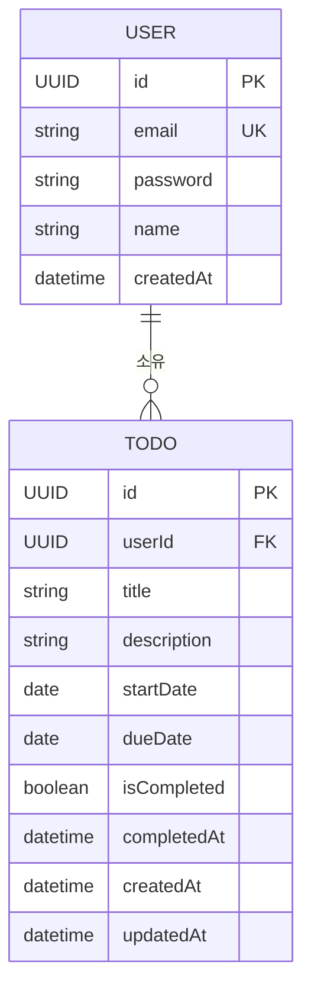

# ERD (Entity Relationship Diagram)

**프로젝트명:** todolist-app
**작성일:** 2026-04-01
**버전:** 1.0.0
**작성자:** Dan Jung

---

## 변경 이력

| 버전 | 날짜 | 변경 내용 | 작성자 |
|---|---|---|---|
| 1.0.0 | 2026-04-01 | 초안 작성 (5-arch-diagram.md에서 분리) | Dan Jung |

---

## 데이터 모델 (ERD)



---

## 엔티티 설명

### USER (사용자)

| 컬럼 | 타입 | 제약 | 설명 |
|---|---|---|---|
| id | UUID | PK | 사용자 고유 식별자 |
| email | string | UK, NOT NULL | 로그인 이메일 (고유값) |
| password | string | NOT NULL | bcrypt 암호화된 비밀번호 |
| name | string | NOT NULL | 사용자 표시 이름 (최대 100자) |
| createdAt | datetime | NOT NULL | 가입일시 (자동 기록) |

### TODO (할일)

| 컬럼 | 타입 | 제약 | 설명 |
|---|---|---|---|
| id | UUID | PK | 할일 고유 식별자 |
| userId | UUID | FK → USER.id | 소유 사용자 참조 |
| title | string | NOT NULL | 할일 제목 (최대 200자) |
| description | string | NULL 허용 | 할일 상세 내용 (최대 2000자) |
| startDate | date | NOT NULL | 할일 시작일 |
| dueDate | date | NOT NULL | 할일 종료일 (CHECK: dueDate >= startDate) |
| isCompleted | boolean | NOT NULL, DEFAULT false | 완료 여부 |
| completedAt | datetime | NULL 허용 | 완료 처리 일시 (isCompleted=true 시 자동 기록) |
| createdAt | datetime | NOT NULL | 생성일시 (자동 기록) |
| updatedAt | datetime | NOT NULL | 수정일시 (자동 갱신) |

---

## 관계

| 관계 | 설명 |
|---|---|
| USER `1` → TODO `N` | 한 사용자는 여러 할일을 소유할 수 있다 |
| TODO → USER | 모든 할일은 반드시 한 명의 사용자에게 속한다 |
| 삭제 정책 | USER 삭제 시 해당 사용자의 TODO 전체 CASCADE 삭제 |

---

## DDL

```sql
CREATE TABLE users (
  id          UUID PRIMARY KEY DEFAULT gen_random_uuid(),
  email       VARCHAR(255) UNIQUE NOT NULL,
  password    VARCHAR(255) NOT NULL,
  name        VARCHAR(100) NOT NULL,
  created_at  TIMESTAMP NOT NULL DEFAULT CURRENT_TIMESTAMP
);

CREATE TABLE todos (
  id           UUID PRIMARY KEY DEFAULT gen_random_uuid(),
  user_id      UUID NOT NULL REFERENCES users(id) ON DELETE CASCADE,
  title        VARCHAR(200) NOT NULL,
  description  TEXT,
  start_date   DATE NOT NULL,
  due_date     DATE NOT NULL,
  is_completed BOOLEAN NOT NULL DEFAULT false,
  completed_at TIMESTAMP,
  created_at   TIMESTAMP NOT NULL DEFAULT CURRENT_TIMESTAMP,
  updated_at   TIMESTAMP NOT NULL DEFAULT CURRENT_TIMESTAMP,
  CONSTRAINT chk_date_order CHECK (due_date >= start_date)
);

CREATE INDEX idx_todos_user_id   ON todos(user_id);
CREATE INDEX idx_todos_due_date  ON todos(due_date);
CREATE INDEX idx_todos_created_at ON todos(created_at DESC);
```
